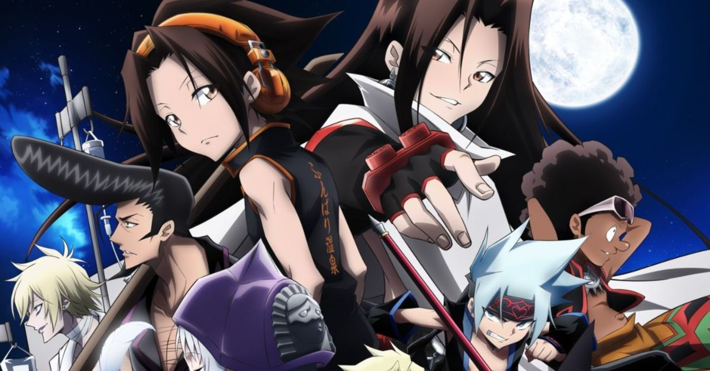

<h1 align="center">Shaman King API</h1>

<p align="center">
API with information about Shaman King 🧙‍♂️🔮
</p>


<p align="center">
    
</p>

## About Shaman King API

This project aims to provide information and images about Shaman King Anime.

## What is an API?

An API (Application Programming Interface) is a contract that allow developers to interact with an application through a set of interfaces. In this case, the application is a database with Shaman King anime information, and the interfaces are URL links. A RESTful API is an API that conforms to a set of loose conventions based on HTTP verbs, errors, and hyperlinks.

## Try the project

Get Character 1 information:

https://shaman-king-api.herokuapp.com/api/v1/characters/1

Result:

```json
{
    "id": 1,
    "name": "",
    "age": null,
    "birthplace": "",
    "nationality": "",
    "gender": "",
    "occupation": "",
    "image": "",
    "description": ""
}
```

## Routes

| END POINT        | HTTP METHOD GET     |
| -----------      | ---------------     |
| /characters      | List all Characters |
| /characters/{id} | Show Character      |
| /spirits          | List all Spirits     |
| /spirits/{id}     | Show Spirit          |

## Usage

[to edit...]

## Contact me
Let me know about the cool projects you develop with Shaman King API 😄

- Follow me on Twitter, I usually share development stuff  
- Did you use or see the project? Share with me your feedback! <a href="https://twitter.com/intent/tweet?text=Hi! @Lmendev I just saw your project &url=https%3A%2F%2Fgithub.com%2FLmendev%2Fshaman-king-api"></a>

## Contributing

Thank you for considering contributing to Shaman King API

- You can contribute by sending information about characters or spirits that have not yet been added.
- You can also contribute by suggesting improvements to the project, code, endpoints, etc.
- Reporting bugs 

In any case, feel free to create [a new issue](https://github.com/lmendev/shaman-king-api/issues) with detailed explanation please!

## Software requirements

- GIT
- NODE
- NPM

## Installation

* `git clone https://github.com/lmendev/shaman-king-api`
* `cd shaman-king-api`
* `npm i`
* Copy and rename .env.example file to .env
* Check everything is OK accessing on http://localhost:8000/api/v1/characters/1


## Sources
Information gathered from various resources:

- [shamanking.fandom](https://shamanking.fandom.com/)

## License

The story of Shaman King, images and designs are copyrighted material. This is a fan made project and is not intended to infringe on any copyrighted material. Images and synopses of Shaman King material is intended to be used for information, review and research purposes only for other fans and is in no way used for profit.

All images are copyright of their respective owners. Shaman King © Hiroyuki Takei / Kodansha Ltd. Shaman King: Flowers © Hiroyuki Takei / Kodansha Ltd. Shaman King: Marcos © Hiroyuki Takei, Jet Kusamura/Kodansha Ltd. Shaman King: Red Crimson © Hiroyuki Takei, Jet Kusamura/Kodansha Ltd. Shaman King: The Super Star © Hiroyuki Takei / Kodansha Ltd. Shaman King: Zero © Hiroyuki Takei / Kodansha Ltd. All other logos/trademarks are copyright of their respective owners/companies. [Kodansha Copyright](https://kodansha.us/copyright/). Images on this project are used for review and illustration purposes only.

Shaman King API source code is open-sourced software licensed under the [MIT license](https://opensource.org/licenses/MIT).
